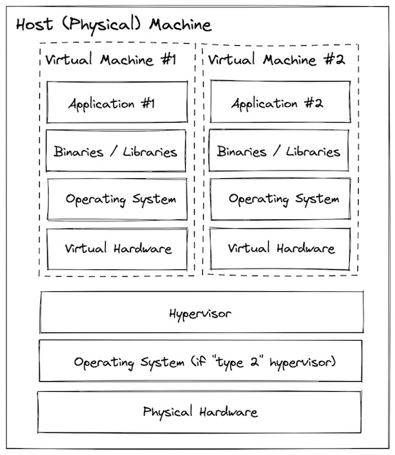

# Fundamentos de docker I

- [Motivación](#motivación)
- [Tecnología Docker](/contenido/clase1/00-tecnologia/readme.md)
- [Instalación Docker](/contenido/clase1/01-instalacion/readme.md)
- [Imagenes](/contenido/clase1/02-imagenes/readme.md)
- [Volumenes](/contenido/clase1/03-volumenes/readme.md)
- [Gestion](/contenido/clase1/05-gestioncontenedores/readme.md)

# Motivación

Motivación del uso de contenedores

  - Escalabilidad y uso de recursos 
  - Facilidad de colaboración 
  - Facilitar la adopción de usar el cloud
  - Agilizar el desarrollo y proceso de despliegue
  - Velocidad y eficiencia
  - Aislamiento y seguridad
  - Portabilidad y consistencia 

---
- [Historia de la virtualizacion](#history-of-virtualization)
    - [Bare Metal](#bare-metal)
    - [Virtual Machines](#virtual-machines)
    - [Containers](#containers)
   

## Historia de la virtualización
### Bare Metal
Antes de que se inventara la virtualización, todos los programas se ejecutaban directamente en el sistema host. La terminología que mucha gente usa para esto es "bare metal". Si bien eso suena elegante y aterrador, es casi seguro que está familiarizado con la ejecución en bare metal porque eso es lo que hace cada vez que instala un programa en su computadora portátil / computadora de escritorio.

Con un sistema bare metal, el sistema operativo, los archivos binarios/bibliotecas y las aplicaciones se instalan y ejecutan directamente en el hardware físico.

Esto es fácil de entender y el acceso directo al hardware puede ser útil para una configuración específica, pero puede conducir a:

- Conflictos de dependencia infernales
- Baja eficiencia de utilización
- Velocidad lenta de arranque y apagado (minutos)
- Aprovisionamiento

---
### Virtual Machines
Las máquinas virtuales usan un sistema llamado "hipervisor" que puede dividir los recursos del host en múltiples configuraciones de hardware virtual aisladas que luego puede tratar como sus propios sistemas (cada uno con un sistema operativo, archivos binarios/bibliotecas y aplicaciones).

Esto ayuda a mejorar algunos de los desafíos presentados por bare metal, sin embargo trae otros como:

- Ocupan mucho espacio
- Tiempo de booteo elevado
- Correr múltiples VMs tiene impacto en el rendimiento
- Escalamiento

---

### Containers
Los contenedores son similares a las máquinas virtuales en el sentido de que brindan un entorno aislado para instalar y configurar archivos binarios/bibliotecas, pero en lugar de virtualizar en la capa de hardware, los contenedores utilizan características nativas de Linux (cgroups + espacios de nombres) para proporcionar ese aislamiento mientras comparten el mismo kernel.

Este enfoque da como resultado que los contenedores sean más "ligeros" que las máquinas virtuales y brinden las siguientes ventajas:

- Portabilidad y consistencia
- Escalabilidad y uso eficiente de recursos
- Velocidad en el desarrollo y despliegue
- ¡Suficientemente liviano para usar en desarrollo!

---

