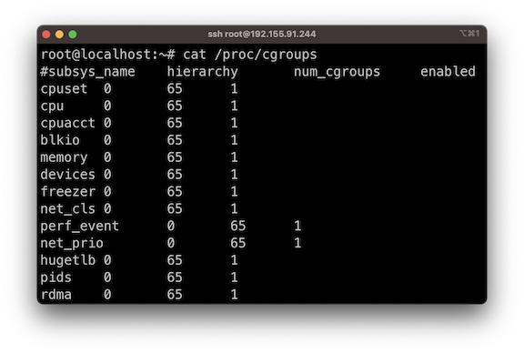
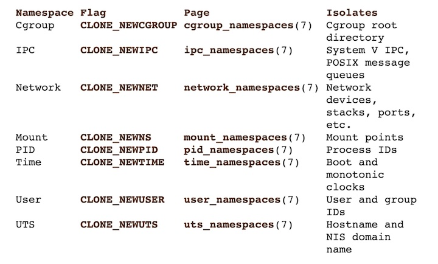
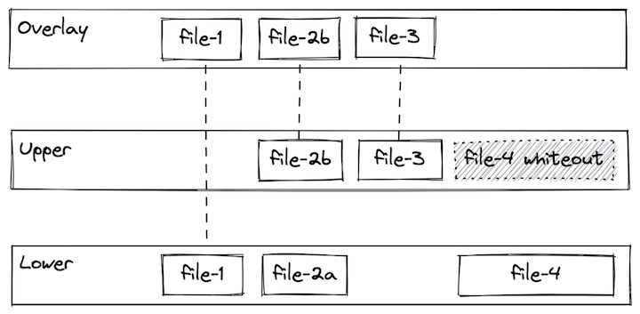

# Tecnología Docker

<!-- no toc -->
- [Linux Building Blocks](#linux-building-blocks)
  - [Cgroups](#cgroups)
  - [Namespaces](#namespaces)
  - [Union filesystems](#union-filesystems)

## Linux Building Blocks

Los contenedores aprovechan las funciones del kernel de Linux cgroups y espacios de nombres para proporcionar restricciones de recursos y aislamiento de aplicaciones, respectivamente. También utilizan un sistema de archivos de unión que permite crear imágenes sobre capas comunes, lo que hace que crear y compartir imágenes sea rápido y eficiente.

***Nota:*** Docker no inventó los contenedores. Por ejemplo, los contenedores LXC (https://linuxcontainers.org/) se implementaron en 2008, cinco años antes del lanzamiento de Docker. Dicho esto, Docker logró grandes avances en la experiencia de los desarrolladores, lo que ayudó a que las tecnologías de contenedores ganaran una adopción masiva y sigue siendo una de las plataformas de contenedores más populares.

---
## Cgroups

Los Cgroups son una característica del kernel de Linux que permite que los procesos se organicen en grupos jerárquicos cuyo uso de varios tipos de recursos se puede limitar y monitorear.

Con cgroups, el tiempo de ejecución de un contenedor puede especificar que un contenedor debería poder usar (por ejemplo):
* Use hasta el XX% de los ciclos de CPU (cpu.shares)
* Use hasta YY MB de memoria (memory.limit_in_bytes)
* Throttle lee hasta ZZ MB/s (blkio.throttle.read_bps_device)

## Namespaces

Un "namespace" envuelve un recurso del sistema global en una abstracción que les hace parecer a los procesos dentro del espacio de nombres que tienen su propia instancia aislada del recurso global.

Los cambios en el recurso global son visibles para otros procesos que son miembros del espacio de nombres, pero son invisibles para otros procesos.

Con los espacios de nombres, un tiempo de ejecución de contenedor puede mantener los procesos fuera del contenedor invisibles dentro del contenedor o asignar el usuario dentro del contenedor a un usuario diferente en el host (entre otras cosas).

## Union filesystems

Un "Union filesystem" permite que los archivos y directorios de sistemas de archivos separados, conocidos como ramas, se superpongan de forma transparente, formando un único sistema de archivos coherente.

Los contenidos de los directorios que tienen la misma ruta dentro de las ramas fusionadas se verán juntos en un solo directorio fusionado, dentro del nuevo sistema de archivos virtual.

Este enfoque permite un uso eficiente del espacio porque las capas comunes se pueden compartir. Por ejemplo, si se crean varios contenedores a partir de la misma imagen en un solo host, el tiempo de ejecución del contenedor solo tiene que asignar una superposición delgada específica para cada contenedor, mientras que las capas de imagen subyacentes se pueden compartir.

