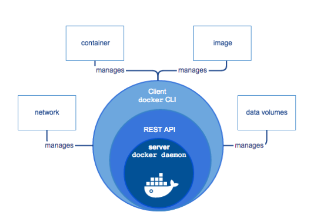

# Instalación de Docker

Dependiendo del sistema operativo utilizado, realizar la instalación de Docker y docker-compose (sólo Linux)

- Windows
- MacOS
- Linux (CentOS, Debian, Ubuntu, Fedora).

### Docker Desktop on Linux

#### CentOS 7+
```bash
sudo yum install -y yum-utils device-mapper-persistent-data lvm2
sudo yum-config-manager --add-repo https://download.docker.com/linux/centos/docker-ce.repo
sudo yum install docker-ce
sudo systemctl start docker
```

#### Ubuntu 16.04+

```sh
# Actualizamos apt con los ultimos paquetes
sudo apt update
# Instalamos dependencias
sudo apt install apt-transport-https ca-certificates curl software-properties-common
# Agregamos la llave GPG del repo oficial de Docker
curl -fsSL https://download.docker.com/linux/ubuntu/gpg | sudo apt-key add -
# Agregamos el repo de Docker a las fuentes de APT
sudo add-apt-repository "deb [arch=amd64] https://download.docker.com/linux/ubuntu focal stable"
# Instalamos docker-ce
sudo apt install docker-ce
# Revisemos que tiene el servicio corriendo
sudo systemctl status docker
# Darle permiso a nuestro usuario para correr docker
# Por defecto docker sólo corre con root
sudo usermod -aG docker ${USER}
# Nos relogueamos a la terminal o saltamos a una sub shell
su - ${USER}
# Verificamos que entre los grupos tenemos a docker
groups
```

### Docker Desktop on Windows
- https://docs.docker.com/docker-for-windows/

### Docker Desktop on MAC
- https://docs.docker.com/docker-for-mac/


# Diagrama básico de la arquitectura de docker




`Docker Daemon`: el motor Docker utiliza un proceso daemon como servidor que se ejecuta en segundo plano del sistema host y proporciona un control central 
del motor Docker. También es responsable de crear y administrar todas las imágenes, contenedores o redes.

`La API REST`: especifica una serie de interfaces que permiten que otros programas interactúen con el daemon y le den instrucciones. Uno de estos programas es el terminal del sistema operativo.

`La terminal`: Docker utiliza la terminal del sistema operativo como un programa cliente, que interactúa con el daemon a través de la API REST y permite a los usuarios controlarlo a través de scripts o comandos.


# Algunos comandos de Docker

[Docker Cheat Sheet](https://github.com/wsargent/docker-cheat-sheet)
Una vez instalado Docker, todo se gestiona mediante comandos:

```bash
docker COMANDOS
```
Para ver los comandos disponibles (en general y en particular):

```bash
docker
docker image
docker network
```
Para ver las opciones de cada comando:
```bash
docker cp --help
```

Los comandos tienen a su vez opciones. Los nombres de las opciones van precedidas de los caracteres -- y entre la opción y su valor se puede escribir un espacio o el carácter =.
```bash
docker COMANDO --OPCION=VALOR
docker COMANDO --OPCION VALOR
```
Si el valor de una opción contiene espacios, escriba el valor entre comillas
```
docker COMANDO --OPCION="VALOR CON ESPACIOS"
docker COMANDO --OPCION "VALOR CON ESPACIOS"
```

## Imágenes

En los comandos siguientes REPOSITORIO es el nombre del repositorio en el que se encuentra la imagen (por ejemplo usuario/phpmyadmin) e IMAGEN es el nombre de la imagen descargada. Realmente, las imágenes descargadas se llaman igual que los repositorios de donde se han descargado, pero he distinguido los nombres para dejar claro cuándo nos estamos haciendo referencia a la imagen del repositorio y cuándo a la imagen local.

Para gestionar las imágenes, se utiliza el comando:
```bash
docker image OPCIONES
```

Para descargar una imagen:
```bash
docker image pull REPOSITORIO
docker pull REPOSITORIO
```

Para ver las imágenes ya descargadas:
```bash
docker image ls
```

Para borrar una imagen (se deben borrar previamente los contenedores basados en esa imagen):
```bash
docker image rm IMAGEN
```

## Contenedores

En los comandos siguientes CONTENEDOR es el nombre del contenedor, que podemos elegir al crearlo, y RED es el nombre de una red ya existente.

Para crear un contenedor (y ponerlo en marcha):
```bash
docker run --name=CONTENEDOR REPOSITORIO
```
El problema de este comando es que dejamos de tener acceso a la shell y sólo se puede parar el proceso desde otro terminal.
Lo habitual es poner en marcha el contenedor en modo separado (detached), es decir, en segundo plano, yasí podemos seguir utilizando la shell:

```bash
docker run -d --name=CONTENEDOR REPOSITORIO
```

Si queremos ver la secuencia de arranque del contenedor, podemos poner en marcha el contenedor en modopseudo-tty, que trabaja en primer plano, pero del que podemos salir con Ctrl+C.

```bash
docker run -t --name=CONTENEDOR REPOSITORIO
```
Al crear el contenedor se pueden añadir diversas opciones:

- Para incluir el contenedor en una red privada virtual (y que se pueda comunicar con el resto  de contenedores incluidos en esa red):
```bash
docker run --name=CONTENEDOR --net=RED REPOSITORIO
```
- Para que el contenedor atienda a un puerto determinado, aunque internamente atienda un puerto distinto:
```bash
docker run --name=CONTENEDOR -p PUERTO_EXTERNO:PUERTO_INTERNO REPOSITORIO
```

- Para establecer variables de configuración del contenedor:
```bash
docker run --name=CONTENEDOR -e VARIABLE=VALOR REPOSITORIO
```
- Las variables de configuración se pueden consultar en el repositorio del que obtenemos la imagen.

Para ver los contenedores en funcionamiento:
```bash
docker ps
```

Para ver los contenedores en funcionamiento o detenidos:
```bash
docker ps -a
```
Para detener un contenedor:
```bash
docker stop CONTENEDOR
```

Para detener todos los contenedores:
```bash
docker stop $sudo docker ps -aq)
```
Para borrar un contenedor:
```bash
docker rm CONTENEDOR
```

Para poner en marcha un contenedor detenido:
```bash
docker start CONTENEDOR
```

Para entrar en la shell de un contenedor:
```bash
docker exec -it CONTENEDOR /bin/bash
```
Para entrar en la shell del contenedor como root:
```bash
docker exec -u 0 -it CONTENEDOR /bin/bash
```

Para salir de la shell del contenedor:
```bash
    exit
```

Para copiar (o mover) archivos entre el contenedor y el sistema anfitrión o viceversa:
```bash
docker cp CONTENEDOR:ORIGEN DESTINO
docker cp ORIGEN CONTENEDOR:DESTINO
```

##  Redes

En los comandos siguientes RED es el nombre de la red privada.

Para gestionar las redes, se utiliza el comando:
```bash
docker network OPCIONES
```

Para crear una red:
```bash
docker network create RED
```
Para ver las redes existentes:
```bash
docker network ls
```
Para ver información detallada de una red (entre ella, los contenedores incluidos y sus IP privadas):

```bash
docker network inspect RED
```
Para borrar una red:
```bash
docker network rm RED
```

##  Sistema
 
- Para ver el espacio ocupado por las imágenes, los contenedores y los volúmenes:
```bash
docker system df
```
- Para eliminar los elementos que no están en marcha:
    - Contenedores:
```bash
docker container prune
```
- Imágenes:
```bash
docker image prune
```
- Volúmenes:
```bash
docker volume prune
```
- Redes:
```bash
docker network prune
```
- todo:
```bash
docker system prune
```

