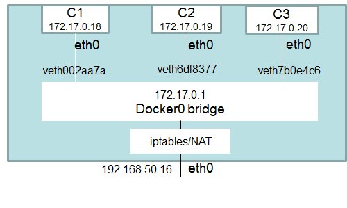

# Networking entre contenedores

Los contenedores envuelven una pieza de software en un sistema de archivos completo que contiene todo lo necesario para ejecutarse: código, tiempo de ejecución, 
herramientas del sistema, librerías, etc: cualquier cosa que se pueda instalar en un servidor. Esto garantiza que el software siempre se ejecutará igual, independientemente de su entorno. Por defecto, los contenedores aíslan las aplicaciones entre sí y de la infraestructura subyacente, al tiempo que proporcionan una capa adicional de protección para las aplicaciones.

Ahora ..¿qué sucede si las aplicaciones necesitan comunicarse entre sí, con el host o con una red externa? ¿Cómo se diseña una red para permitir una adecuada
conectividad manteniendo la portabilidad de las aplicaciones, el descubrimiento de servicios, el equilibrio de carga, la seguridad, el rendimiento y la escalabilidad? 

Es dónde entra en juego la **magia** del concepto de `networking` entre los contenedores

Para que los contenedores Docker se comuniquen entre sí y con el mundo exterior a través de la máquina host, debe haber una capa de red involucrada. Docker admite diferentes tipos de redes, cada una adecuada para ciertos casos de uso.

Docker ya viene con drivers de red orientados a diferentes casos de uso. 

## ¿Qué es docker0 en términos de Docker Networking?

Cuando se instala Docker, se crea una red de puente predeterminada denominada `docker0`. Cada nuevo contenedor de Docker se adjunta automáticamente a este
red, a menos que se especifique una red personalizada.

Además de docker0, Docker crea automáticamente otras dos redes: `host` (sin aislamiento entre el host y los contenedores en esta red, al menos
mundo exterior están en la misma red) y `none` (los contenedores adjuntos se ejecutan en la pila de red específica del contenedor)




## Redes predeterminadas en Docker

`docker network ls` 

- **Bridge**: La  red  bridge  representa  a  la  red  docker0  que  existe  en  todas  las instalaciones  de  Docker.  A  menos  que  use  docker  run -net=opción,  el daemon  de  Docker  conectará  el  contenedor  a  esta  red  de  forma predeterminada.  Usando  el  comando ifconfig en  el  host,  puede  verse  que este Bridge es parte de la pila de red del host.

    ```
    docker run -d -P --net=bridge nginx:1.9.1
    #Inpeccionar la red bridge: `# docker network inspect bridge`
    ```
    
- **None**: La  red  agrega  un  contenedor  a  una  pila  de  red  específica  del contenedor sin conectarlo a ningún interfaz de red.  $ Docker network inspect none

    ```
    $ docker run -d -P --net=none  nginx:1.9.1
    $ docker ps
    $ docker inspect <ID:docker> | grep IPAddress
    ```


- **Host**: La  red  agrega  un  contenedor  a  la  pila  de  red  del  host.  Se  puede comprobar que la configuración de red en el contenedor es la misma que el host.

    ```
    $ docker run -d --net=host ubuntu:14.04 tail -f /dev/null
    $ ip addr | grep -A 2 eth0:
    $ docker ps
    $ docker exec -it <id:docker> ip addr

    ```
   
    Para inspeccionar la red host: `# docker network inspect host`
    
- **Overlay**:  Para el tipo overlay, necesitas trabajar en modo clúster. Si intentas crear una red de este tipo, sin estar en este modo, obtendrás el siguiente mensaje:

    ```
    $ docker network create --driver overlay multihost-net
    Error response from daemon: This node is not a swarm manager. Use "docker swarm init" or "docker swarm join" to connect this node to swarm and try again
    ```

- **Macvlan**: Existe un cuarto modo llamado macvlan que nos permite asignar IPs de una red a cada uno de los contenedores que viven en nuestro host. Sin embargo, para que este tipo de redes funcione necesitamos que la tarjeta de red del host esté en modo promiscuo, lo cual significa que necesita estar a la escucha de todos los paquetes que viajan por dicha red, simplemente para poder reconocer aquellos que potencialmente pueden ser para uno de sus contendores. Este modo muchas veces no está permitido en muchas organizaciones. La forma de configurar una red de este tipo sería así:

    ```
    $ docker network create -d macvlan \
    --subnet=172.16.86.0/24 \
    --gateway=172.16.86.1 \
    -o parent=eth0 \
    my-macvlan-net
    ```

## Comandos de red docker

Opciones del comando

```
docker network --help
```

Crear una red de prueba de red

```
docker network create network-test
```

```
docker network inspect test-network
```


Iniciamos un  contenedor y lo conectamos a nuestra rede de pruebas

```
docker run -itd --name=test1 --net=network-test busybox
```

Crearemos una red nueva, que se podrá usar para aislar ciertos contenedores, en este caso será la 172.19.0.xx

```
docker network create --driver bridge mi_re docker network create --driver bridge mi_red
```

A partir de crear nuevas redes, las podemos utilizar en contenedores, si arrancamos dos contenedores indicando que usen esa red con “–network xxx” ambos obtendrán un IP de ese rango (172.19.0.2 y 3) y se verán entre si.

```
docker run -d -P --name Contenedor_Nombre --network mi_red imagen_uno
```

#### Por ejemplo:
Correremos dos contenedores en la misma red standard ( bridge ).
```
docker container run --name ubuntu1 ubuntu
docker container run --name ubuntu2 ubuntu
```

Ahora conectaremos ambos contenedores a otra red creada manualmente (test), estaran conectada a la red default y a la red test.

```
docker network connect test ubuntu1
docker network connect test ubuntu2
```

Podemos desconectar esos contendores de la red:
```shell
$ docker network disconnect test ubuntu1
$ docker network disconnect test ubuntu2
``

También podemos borrar esa nueva red.

​```shell
$ docker network rm mi_red
```


## Linkear contenedores

Cuando se crea un nodo de contenedores es necesario que esos contenedores puedan conectarse entre sí por IP o por nombre de host. Pero como ya se dijo, si un contenedor se apaga al iniciarse nuevamente se generan nuevos parámetros como el ID y la IP que utiliza.

Para poder salvar este problema, existe la funcionalidad de «*linkear*«, enlazar, uno o más contenedores que permitirá que cada vez que uno de los contenedores enlazados se apague y se encienda, no importe la IP que el motor docker le asigne ya que se conectarán por el nombre de contenedor. Toda la magia necesaria la realiza el motor docker, como por ejemplo las reglas de ruteo, las reglas dns, etc.

Para poder enlazar contenedores se debe utilizar la variable «–link» al crear un contenedor con el comando 

`docker run -itd --link ID/contenedor01 --name contenedor01 -h contenedor02 ubuntu`
