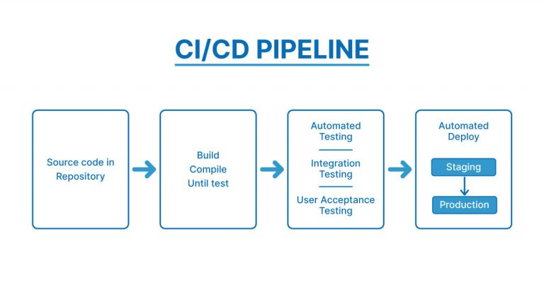

# CI/CD en Docker

La integración continua y el despliegue continuo (CI/CD) es una práctica de desarrollo de software que se enfoca en automatizar el proceso de integración de cambios de código, probarlos e implementarlos en producción de manera consistente y eficiente. Cuando se combina con Docker, CI/CD puede ayudar a optimizar el desarrollo y la implementación de aplicaciones en contenedores. Aquí hay una descripción general de la configuración de una canalización de CI/CD para aplicaciones basadas en Docker:



Las soluciones actuales de CI/CD siguen un enfoque de entornos de varios niveles: desarrollo, prueba, puesta en escena y producción. Cada uno de estos ambientes son administrados de forma independiente entre sí. Por lo tanto, cada uno de estos entornos puede tener diferentes configuraciones, diferentes versiones de la biblioteca o incluso diferentes sistemas Operativos.

Esto conduce al popular problema conocido como síndrome de "funciona en mi máquina" en el que una aplicación que funciona en un entorno deja de funcionar.


# Docker al rescate !!

La integración continua y el despliegue continuo se han convertido en uno de los casos de uso más comunes de los usuarios de Docker.
CI/CD fusiona el desarrollo con las pruebas, lo que permite a los desarrolladores crear código en colaboración, enviarlo a la rama principal y comprobar si hay diferencias. Esto permite a los desarrolladores no solo crear su código, sino también probarlo en cualquier tipo de entorno y, con la mayor frecuencia posible, detectar errores temprano en el ciclo de vida de desarrollo de aplicaciones.

Dado que Docker puede integrarse con herramientas como Jenkins y GitHub, los desarrolladores pueden enviar código en GitHub, probar el código y automáticamente active una compilación con Jenkins y, una vez que la imagen esté completa, se pueden agregar imágenes a los registros de Docker.

Esto agiliza el proceso, ahorra tiempo en los procesos de creación y configuración, al mismo tiempo que permite a los desarrolladores ejecutar pruebas en paralelo y automatizar ellos para que puedan continuar trabajando en otros proyectos mientras se ejecutan las pruebas.
Dado que Docker funciona localmente, en la nube o en un entorno virtual y es compatible con Linux y Windows, las empresas ya no tienen que lidiar con inconsistencias entre diferentes tipos de entornos. Quizás uno de los beneficios más conocidos de la plataforma Docker 


## CI utilizando GithubActions con Docker
```
name: Docker CI

on:
  push:
    branches:
      - main  # Change this to the branch you want to trigger the workflow on

jobs:
  build:
    name: Build and Test
    runs-on: ubuntu-latest

    steps:
    - name: Checkout code
      uses: actions/checkout@v2

    - name: Build and test with Docker
      run: |
        docker build -t my-app .
        docker run my-app npm test  # Adjust this command to your testing process

```

## CI/CD utilizando GithubActions con Docker

```
on:
  push:
    branches:
      - main  # Change this to the branch you want to trigger the workflow on

jobs:
  build-and-deploy:
    name: Build, Test, and Deploy
    runs-on: ubuntu-latest

    steps:
    - name: Checkout code
      uses: actions/checkout@v2

    - name: Build Docker image
      run: docker build -t my-app .

    - name: Run tests
      run: docker run my-app npm test  # Adjust this command to your testing process

    - name: Login to Docker Hub
      uses: docker/login-action@v1
      with:
        username: ${{ secrets.DOCKER_USERNAME }}
        password: ${{ secrets.DOCKER_PASSWORD }}

    - name: Push Docker image
      run: |
        docker tag my-app:latest your-docker-username/my-app:latest
        docker push your-docker-username/my-app:latest

    - name: Deploy to Production
      run: |
        # Add deployment steps here, like Kubernetes apply, server restart, etc.
```


# Ejemplo utilizando GitHub Actions

[GithubActionsconDocker](/extras/07-cicd/)
