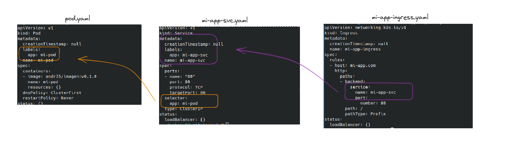

# Introducción Kubernetes

Ya tenemos una imagen, pudimos correr un contenedor, pudimos correr varios contenedores, orquestarla con docker-compose, luego desplegarla en Docker-Swarm  y ahora si queremos llevarla a Kubernetes, ¿cómo seguimos?

Kubernetes puede ser instalado de muchas formas, e incluso instanciado en servicios de las distintas nubes públicas como AWS Elastic Kubernetes Services (EKS), Azure Kubernetes Service (AKS), Google Kubernetes Engine (GKE), entre otros. Dado que los servicios en la nube cuestan dinero, podemos empezar con algo sencillo de forma local.

Poder hacer uso de Kubernetes de forma local como Docker-Swarm. Primero porque te acerca a la tecnología sin una barrera inicial alta (como sería el costo de usarlo), y segundo porque cada vez el proceso es más sencillo, al punto tal que con un comando podemos crear un cluster con varios nodos... todo en un solo ordenador.

## Instalación de Kubernetes en local


Kubernetes tiene muchísimas opciones para instalar en local, de forma fácil y rápida. Si van a cualquier guía, seguramente se encontrarán con las opciones de microk8s, minikube, kind, k3d, k3s.

Para este repositorio utilizaremos `kind` para crear un cluster de Kubernetes (en el apartado extra dejo unos scripts para crearlo sobre un máquina virtual ubuntu v.1804 con 4GB mínimo)


`kind` es ideal para la creación de clústeres locales de Kubernetes con fines de desarrollo y pruebas. Para entornos de producción o más complejos, es posible que desees considerar otras soluciones de orquestación como kubeadm o plataformas administradas en el cloud (AWS: `eksctl`).


## Veamos nuestro mini cluster andando

Un ejemplo de lo que puede pasar (si todo va bien), esto demora aproximadamente 1 o 2 minutos.

> Si intentan mapear el rango completo de NodePorts (30000-32767) puede que falle Docker, más info en los [enlaces sugeridos](#enlaces-sugeridos).

Lo primero que haremos es ver que pods se han creado.

> ¿Qué es un pod?
> Es la unidad más pequeña de Kubernetes y representa a uno o más contenedores que comparten almacenamiento y red entre ellos.
> Un pod modela un *host lógico*, lo cual desde dentro del pod se representa como un host individual.


```sh
╰─ kubectl get pods -A
NAMESPACE             NAME                                       READY    STATUS      RESTARTS        AGE
kube-system          coredns-565d847f94-6wlwn                     1/1     Running     4 (2d12h ago)   114d
kube-system          coredns-565d847f94-hqrbf                     1/1     Running     4 (2d12h ago)   114d
kube-system          etcd-kind-control-plane                      1/1     Running     2 (2d12h ago)   69d
kube-system          kindnet-mjgp5                                1/1     Running     4 (2d12h ago)   114d
kube-system          kindnet-qhw2t                                1/1     Running     4 (2d12h ago)   114d
kube-system          kindnet-qpwkj                                1/1     Running     4 (2d12h ago)   114d
kube-system          kube-apiserver-kind-control-plane            1/1     Running     2 (2d12h ago)   69d
kube-system          kube-controller-manager-kind-control-plane   1/1     Running     4 (2d12h ago)   114d
kube-system          kube-proxy-4zg7v                             1/1     Running     4 (2d12h ago)   114d
kube-system          kube-proxy-b6rc2                             1/1     Running     4 (2d12h ago)   114d
kube-system          kube-proxy-hzbww                             1/1     Running     4 (2d12h ago)   114d
kube-system          kube-scheduler-kind-control-plane            1/1     Running     4 (2d12h ago)   114d

```

Tardarán un rato hasta ponerse en Running o Completed, dos de los muchos estados en los que puede terminar un pod.

## Primera prueba de pod

```bash
# Creamos un pod "mi-pod" usando la imagen de "nginx", un conocido web server
╰─ kubectl run mi-pod --image=nginx --restart=Never
pod/mi-pod created
# Luego procedemos a conectarnos a ella por shell y ejecutar algunos comandos
╰─ kubectl exec -ti mi-pod -- /bin/bash
# En este momento estamos dentro del contenedor principal del pod
root@mi-pod:/# hostname
mi-pod
``` 

El siguiente paso es exponer nuestra aplicación de forma fácil, con un `port-forward`.

```bash
# Con 8080 especificamos el puerto local, y 80 el puerto del pod al que conectamos
╰─ kubectl port-forward mi-pod 8080:80
Forwarding from 127.0.0.1:8080 -> 80
Forwarding from [::1]:8080 -> 80
# Una vez probado el acceso via browser, podemos matar el proceso con CTRL+C
```

Abrimos <http://localhost:8080> en nuestro ordenador y veremos un NGINX funcionando.


## Nuestra app en un Pod

Ya que tenemos nuestro propia imágen de contenedor, vamos a ponerla a prueba.

Podemos hacerlo del mismo modo que con la imagen de nginx, o podemos ir un poco más allá y hacerlo de forma declarativa, por medio del lenguaje YAML. Para empezar, usaremos `kubectl` para que nos de una mano.

```bash
# Con dry-run=client, simulamos una acción, y con -o yaml exportamos la salida a ese formato
kubectl run mi-pod --image=andr35/imagen:v0.1.0 --restart=Never --dry-run=client -o yaml > mi-pod.yaml
# Esto nos genera el archivo: mi-pod.yaml
```

El contenido de este YAML nos da una base como para empezar a tener nuesta aplicación de forma declarativa en Kubernetes. De este modo, podemos iterar sobre el YAML para ir mejorando nuestro despliegue.

Nuestro siguiente paso es probar dicho pod.

```bash
# Al ser un YAML/declarativo, con apply -f podemos aplicar el manifiesto
kubectl apply -f extras/08-kubernetes/deploy-01/mi-pod.yaml
# Luego podemos ver el estado del pod
kubectl get pod mi-pod
```

Esto significa que ¡ya tenemos nuestra aplicación corriendo en Kubernetes! y lo mejor aún, ahora tenemos una definición de dicha definición.

## Entendiendo mi-pod.yaml

Cuando corrimos el comando con `--dry-run=client`, se nos generó un YAML con el siguiente contenido.

```yaml
apiVersion: v1
kind: Pod
metadata:
  creationTimestamp: null
  labels:
    run: mi-pod
  name: mi-pod
spec:
  containers:
  - image: andr35/imagen:v0.1.0
    name: mi-pod
    resources: {}
  dnsPolicy: ClusterFirst
  restartPolicy: Never
status: {}
```

En la primera sección, se le dice al API server de Kubernetes, que versión y tipo de recurso usar:

```yaml
apiVersion: v1
kind: Pod
```

`apiVersion` especifica la versión de la API de Kubernetes que se utilizará para interpretar el recurso descrito en el archivo. La API de Kubernetes evoluciona con el tiempo, y diferentes versiones pueden introducir cambios y mejoras en los recursos y comportamientos disponibles.

`kind` define el tipo de objeto que se está describiendo en el archivo. Indica a Kubernetes qué tipo de recurso se creará o administrará. Hay varios tipos de recursos en Kubernetes, como Pod, Deployment, Service, ConfigMap, Secret, etc.

Siguiendo con el YAML, tenemos la `metadata` del pod. Esta información es usada por Kubernetes durante la creación y tiene, entre sus tantos atributos, la posibilidad de fijar el nombre del recurso (`name`), las etiquetas asociadas a él (`labels`), entre otros.

`labels`: Son pares clave-valor que se utilizan para etiquetar el recurso. Las etiquetas son útiles para organizar y seleccionar objetos y para aplicar reglas y políticas específicas.


Cabe señalar que los campos específicos de la `metadata` pueden variar según el tipo de recurso que estés creando. Siempre es importante verificar la documentación oficial de Kubernetes para conocer los campos de metadata adecuados para el recurso que estás configurando.

`status`: se encuentra en los objetos de recursos y proporciona información sobre el estado actual del recurso en el clúster. Este campo es actualizado y mantenido por el sistema de Kubernetes y proporciona información sobre cómo se está comportando el recurso en tiempo real.

En el medio, contamos con el `spec` del objeto, en este caso, de un `pod`:

```yaml
spec:
  containers:
  - image: andr35/imagen:v0.1.0
    name: mi-pod
    resources: {}
  dnsPolicy: ClusterFirst
  restartPolicy: Never
```

Lo más simple a la vista es reconocer el uso de nuestra imagen dentro de `containers`. En ese mismo array, tenemos la declaración del nombre del contenedor y los recursos (`resources`), los cuales de momento están vacíos.

Más abajo nos encontramos con `dnsPolicy`, lo cual nos permite a nivel de pod definir cómo se comportará una petición de resolución de nombre, y `restartPolicy`, que nos permite controlar que pasa cuando el pod falla.

## Exponer y probar nuestra app

De la imsma forma que antes, vamos a exponer nuestra aplicación usando `port-forward`, lo cual es bastante sencillo de lograr.

```bash
kubectl port-forward mi-pod 8080:80
```

Navegamos hacia <http://localhost:8080/> y veremos a nuestra aplicación corriendo sobre Kubernetes y exponiendo el puerto del servidor web.

## Formas de exponer servicios

Para un cluster productivo, no podremos hacer uso de `port-forward`

Kubernetes cuenta con varias formas de exponer las cargas de trabajo que corre, entre las que nos encontramos con:

- Servicios de tipo NodePort
- Servicios de tipo LoadBalancer
- Objetos de tipo Ingress

### Servicios de tipo NodePort

Comencemos con la opción más sencilla y disponible en cualquier cluster. El `NodePort` permite hacer uso de un puerto de numeración alta, para exponer servicios en cualquier otro puerto a nivel de pod.

Podemos usar nuevamente el comando `kubectl create` con `--dry-run=client -o yaml` para producir un YAML válido que nos permite iterar. Del mismo modo que cuando creamos el *pod*.

```bash
kubectl create service nodeport mi-pod --tcp=80 --node-port=30100 --dry-run=client -o yaml > svc-my-pod.yaml
```

Paso siguiente, aplicamos ese manifiesto en Kubernetes

```bash
╰─ kubectl apply -f extras/08-kubernetes/deploy-02/svc-my-pod.yaml
╰─ kubectl get svc
NAME         TYPE        CLUSTER-IP     EXTERNAL-IP   PORT(S)        AGE
kubernetes   ClusterIP   10.43.0.1      <none>        443/TCP        8m34s
mi-pod       NodePort    10.43.99.120   <none>        80:30100/TCP   4m47s
```

Siguiente paso, probamos en nuestro navegador apuntando a ese puerto <http://localhost:30100/>

¿Que pasó

En la definición de un servicio, es necesario especificar a quien vamos a apuntar con el servicio. Para esto, Kubernetes utiliza **labels** (etiquetas) y **selectors**. Del lado del recurso a identificar, aplicaremos **labels** a los elementos (en este caso, un pod) y del lado del objeto que quiere asociarse, el servicio, un selector.

Una forma de ver que un servicio no está apuntando a donde debe, es simplemente revisar los endpoints del mismo. Veamos en nuestro caso:

```bash
╰─ kubectl get endpoints
NAME         ENDPOINTS           AGE
kubernetes   192.168.48.2:6443   16m
mi-pod       <none>              12m
```

Aquí podemos ver dos servicios, uno `kubernetes` que se crea por defecto y apunta al API server de un cluster, mientras que también tenemos `mi-pod` que apunta a nuestro servicio generado. Si vemos en la columna de `endpoints`, está vacía, por lo cual no hay forma que el servicio llegue a destino.

Ahora bien, si vemos la [definición de nuestro pod](../../extras/08-kubernetes/deploy-01/mi-pod.yaml), éste ya tiene un label definido (`run: mi-pod`), mientras que si vemos la [definición de nuestro servicio](../../extras/08-kubernetes/deploy-02/svc-my-pod.yaml) vemos que el `selector` apunta a `app: mi-pod`. El uso del label `app` es una buena práctica, por lo que actualizaremos el código de nuestro pod para que refleje el label correcto.

> El *debugging* en Kubernetes es complicado al comienzo. Hay muchas aristas a considerar, y a veces puede ser frustrante. En este mismo taller, más sobre el final, daremos un par de tips sobre cómo hacer *troubleshooting* de una forma genérica que te servirá para identificar casi cualquier problema.

Una vez que actualizamos los `labels` del pod a `app: mi-pod`, procedemos a aplicar el nuevo manifiesto. Si revisamos nuevamente los `endpoints`, nos damos con que ahora ya tiene un ip y puerto:

```bash
╰─ kubectl get ep 
NAME         ENDPOINTS         AGE
kubernetes   172.18.0.3:6443   18h
mi-pod       10.244.2.61:80    6m54s
```

Consecuentemente, si revisamos que ip tiene nuestro pod, nos daremos cuenta que el selector está funcionando correctamente.

```bash
╰─ kubectl get pod mi-pod -o wide
NAME     READY   STATUS    RESTARTS   AGE   IP            NODE           NOMINATED NODE   READINESS GATES
mi-pod   1/1     Running   0          92s   10.244.2.61   kind-worker2   <none>           <none>

```

> El uso de `-o wide` en `kubectl` es bien útil para obtener más información sobre un objecto. Por simplicidad, la mayoría de los comandos muestran muy poca información por defecto, pero si queremos saber más, siempre podemos usar este parámetro o hacer uso de `kubectl describe` que brinda aún más información!

Hagamos nuevamente la prueba de conectarnos al servicio por medio del NodePort visitando <http://localhost:30100/>

Si bien suena mágico que por medio de `NodePort` logremos exponer nuestra aplicación en unas pocas líneas de código, hay que ser realista y pensar en un entorno productivo. Hay muchas limitaciones para el uso de NodePort si nuestra aplicación vive en Internet, ¿acaso alguna vez visitaron google tipeando <http://www.google.com:443>? imagínense usando en cambio <http://www.mi-app.com:30100>! Más de uno desconfiaría y directamente ni visitaría nuestra aplicación. Por otro lado, hay un rango de 2768 puertos disponibles por defecto, y cada puerto implica una mayor complejidad en nuestra red para administrarlo (con posibles colisiones).

> Para laboratorios y/o redes internas, el uso de NodePort es más que suficiente. En Producción, si no tenemos otra alternativa que el uso de NodePort, siempre podemos poner un *Application Load Balancer* enfrente que se haga cargo de exponer un puerto más estándar, aunque debemos considerar las otras limitaciones de los NodePort.

### Servicios de tipo LoadBalancer

Gracias a la existencia de múltiples proveedores en la nube (AWS, Azure, GCP), hay muchos servicios de Balanceo de Carga disponible (ALB, NLB, ALB+WAF), los cuales son pagos salvo sus versiones más reducidas. Para entornos fuera de la nube, tenemos distintas soluciones de Balanceo de Carga a nuestra disposición, las cuales requieren la presencia de un controlador dentro de Kubernetes para poder hacer uso de ellas por medio de Servicios. La solución más sugerida es [MetalLB](https://metallb.universe.tf/), pero existen [muchos otros disponibles en la actualidad](https://landscape.cncf.io/card-mode?category=service-proxy&project=hosted,no&grouping=category).

Debido a la complejidad del uso de estos servicios para un entorno de pruebas como k3d ó kind, vamos a omitir este paso y saltar directo a Ingress.

### Objetos de tipo Ingress

La solución más usual para exponer cargas de trabajo en Kubernetes suele terminar siendo un **Ingress Controller**.

En su formato más básico, un usuario ingresa a un dominio (ej: mi-app.com), lo cual está apuntando en algún DNS hacia la IP expuesta a Internet de nuestro Ingress Controller.

Una vez que la conexión llega, si existe un objeto de tipo `Ingress` en dicho controlador, este interpretará su definición para entender, por medio de los `selectors`, a que servicio debe enviarle la conexión entrante. El servicio, por su parte, mantiene una lista de `endpoints` de forma constante, gracias al uso de `selectors` apuntando a los `labels` de los pods objetivos.

En este diagram podemos apreciar los pasos de forma muy simplista.

Para poder exponer un servicio haciendo uso de un objeto de tipo `Ingress`, necesitamos como mínimo un `Ingress Controller`. Existen muchos en el mercado, del mismo modo que con los controladores de balanceo de carga, y Kubernetes no trae ninguno por defecto instalado. En lo positivo, gracias a las `IngressClass`, podemos hacer uso de más de un controlador de `Ingress` por cluster de Kubernetes, lo cual quita un poco la presión de elegir la "mejor opción disponible" al momento de crear nuestro cluster.


```bash
# Creamos un servicio de tipo clusterIP
kubectl create service clusterip mi-app-svc --tcp=80 -o yaml --dry-run=client > mi-app-svc.yaml
# Creamos un ingress apuntando a dicho servicio
kubectl create ingress mi-app-ingress --rule="mi-app.com/*=mi-app-svc:80" > mi-app-ingress.yaml
```

Editamos el servicio `mi-app-svc` para que los `selectors` apunten al label correcto, `app=mi-pod` (por defecto estará como `app: mi-app-svc`), y aplicamos ese objeto en el cluster.

``` bash
# Aplicamos
kubectl apply -f extras/08-kubernetes/deploy-03/mi-app-svc.yaml
# Podemos confirmar que encontró los pods
kubectl get endpoints
# Ahora creamos el Ingress también
kubectl apply -f extras/08-kubernetes/deploy-03/mi-app-ingress.yaml
```

Podemos validar que el Ingress se creo y entender que está pasando en este momento:

```bash
╰─ kubectl get ingress 
NAME             CLASS    HOSTS                                             ADDRESS     PORTS   AGE
demo-ingress     nginx    hw1.192.168.50.4.nip.io,hw2.192.168.50.4.nip.io   localhost   80      44h
mi-app-ingress   <none>   mi-app.com                                        localhost   80      3m36s

```
Poniendo todo junto, quedaría algo así:



El objetivo Ingress llamado `mi-app-ingress`, sin clase (!), está escuchando tráfico en el Ingress Controller que tenga un *Request* apuntando a `mi-app.com`. 

Si queremos probar esto, deberemos engañar a nuestro sistema operativo, cambiando la definición de `/etc/hosts`.

```bash
╰─ sudo vi /etc/hosts
# Agregar línea con alguno de los IPs del paso previo y el FQDN mi-app.com, ejemplo
╰─ tail -1 /etc/hosts
192.168.48.2 mi-app.com
# Luego hacemos un ping para validar
╰─ ping -c1 mi-app.com
PING mi-app.com (192.168.48.2) 56(84) bytes of data.
64 bytes from mi-app.com (192.168.48.2): icmp_seq=1 ttl=64 time=0.176 ms

--- mi-app.com ping statistics ---
1 packets transmitted, 1 received, 0% packet loss, time 0ms
rtt min/avg/max/mdev = 0.176/0.176/0.176/0.000 ms
```

Si en nuestro navegador visitamos <http://mi-app.com>, veremos nuestra aplicación corriendo (de mentira) en un dominio real.


En el siguiente apartado mejoramos nuestro despliegue a algo más real


# Controladores en Kubernetes

Los `controladores` son componentes que trabajan en segundo plano para garantizar que el estado actual del clúster se ajuste al estado deseado especificado en la definición de los recursos. Los controladores automatizan tareas relacionadas con la gestión y el mantenimiento de los recursos, lo que facilita la administración de aplicaciones en clústeres de Kubernetes. Los controladores son esenciales para el funcionamiento de Kubernetes, ya que ayudan a mantener el estado declarado de los recursos a pesar de los cambios y eventos en el clúster.


A continuación, se presentan algunos ejemplos de controladores en Kubernetes:

`StatefulSet`:
Garantiza que los pods tengan identificadores únicos, diseñados para aplicaciones de estados, como bases de datos y manejar la gestión de volúmenes persistentes.

`DaemonSet`:
Asegura que una copia de un pod se ejecute en cada nodo del clúster o en nodos que cumplan con ciertas etiquetas. Útil para tareas que deben ejecutarse en cada nodo, como agentes de monitoreo.

`ReplicaSet`:
Un controlador que garantiza que un número específico de réplicas (instancias) de un pod se estén ejecutando en todo momento. Si el número de réplicas cae por debajo del valor deseado, el ReplicaSet creará nuevas réplicas. Si es más alto, eliminará el exceso.

`Deployment`:
Un controlador de nivel superior que administra ReplicaSets. Los Deployments permiten actualizar aplicaciones de manera controlada, escalando y gestionando versiones nuevas y antiguas durante el proceso.

En este repositorio solo veremos en detalle los controladores de `Replicaset` y `Deployment`

### ReplicaSet

Los **ReplicaSet** tienen como principal objetivo garantizar una determinada cantidad de pods corriendo al mismo tiempo. Es nuestra responsabilidad definir cuantas réplicas necesitamos de nuestra carga de trabajo. Caso que tengamos una configuración de 4 nodos, podríamos tranquilamente tener un total de 5 réplicas si quisiéramos, investigar cual es la diferencia con tener un  **DaemonSet**.

Creemos un [replicaSet](../../extras/08-kubernetes/deploy-04/replicaSet-mi-app.yaml) para nuestra aplicación.

```yaml

apiVersion: apps/v1
kind: ReplicaSet
metadata:
  name: mi-app
  labels:
    app: mi-app
spec:
  replicas: 3   # En el spec, agregamos la cantidad de replicas que queremos
  selector:
    matchLabels:
      app: mi-app
  template:
    metadata:
      labels:
        app: mi-app
    spec:
      containers:
      - image: andr35/imagen:v0.2.0
        name: mi-pod
        resources: {}
      dnsPolicy: ClusterFirst
      restartPolicy: Always
```

Creamos el **replicaSet** y vemos cómo se comporta.

```bash
╰─ kubectl apply -f extras/deploy-04/replicaSet-mi-app.yaml
replicaset.apps/mi-app configured
╰─ kubectl get pods
NAME           READY   STATUS    RESTARTS   AGE
mi-app-jcg2b   1/1     Running   0          6s
mi-app-ntsz7   1/1     Running   0          6s
mi-app-57krf   1/1     Running   0          6s
```

Como habrán notado, tenemos 3 replicas de nuestro pod, tal como mencionamos anteriormente. Si vemos más información de cada pod, vemos que cada uno se ha ubicado en distintos nodos (esto puede no ocurrir así en una siguiente prueba):

```bash
╰─ kubectl get pods -o wide
NAME           READY   STATUS    RESTARTS   AGE     IP            NODE           NOMINATED NODE   READINESS GATES
mi-app-5s7rj   1/1     Running   0          2m18s   10.244.1.46   kind-worker    <none>           <none>
mi-app-dvlx9   1/1     Running   0          2m18s   10.244.2.64   kind-worker2   <none>           <none>
mi-app-v8cwk   1/1     Running   0          2m18s   10.244.1.45   kind-worker    <none>           <none>
```

Luego de eliminar algunos pods (hasta conseguir lo deseado!) nos encontramos con que ahora ya no se cumple lo de 1 pod en cada nodo, sino que tenemos dos pods corriendo el mismo nodo. 

```bash
 kubectl delete pod mi-app-5s7rj
```

```bash
╰─ kubectl get pods -o wide       
NAME           READY   STATUS    RESTARTS   AGE     IP            NODE           NOMINATED NODE   READINESS GATES
mi-app-dfkpq   1/1     Running   0          3s      10.244.2.65   kind-worker2   <none>           <none>
mi-app-dvlx9   1/1     Running   0          3m10s   10.244.2.64   kind-worker2   <none>           <none>
mi-app-v8cwk   1/1     Running   0          3m10s   10.244.1.45   kind-worker    <none>           <none>

```

Como su nombre lo indica, el fuerte de este controlador son las réplicas, por lo que es muy útil para asegurarnos alta disponibilidad incluso en clusters que tienen pocos nodos. Del mismo modo que se asegura que exista una cierta cantidad de réplicas, podemos hacer que se incremente la cantidad de forma fácil, a modo imperativo:

```bash
╰─ kubectl scale --replicas=5 replicaset/mi-app
replicaset.apps/mi-app scaled
╰─ kubectl get pods -o wide                    
NAME           READY   STATUS              RESTARTS   AGE     IP            NODE           NOMINATED NODE   READINESS GATES
mi-app-dfkpq   1/1     Running             0          79s     10.244.2.65   kind-worker2   <none>           <none>
mi-app-dvlx9   1/1     Running             0          4m26s   10.244.2.64   kind-worker2   <none>           <none>
mi-app-j8ds7   0/1     ContainerCreating   0          1s      <none>        kind-worker    <none>           <none>
mi-app-v8cwk   1/1     Running             0          4m26s   10.244.1.45   kind-worker    <none>           <none>
mi-app-wz9st   0/1     ContainerCreating   0          1s      <none>        kind-worker    <none>           <none>
```

```bash 
NAME           READY   STATUS    RESTARTS   AGE     IP            NODE           NOMINATED NODE   READINESS GATES
mi-app-dfkpq   1/1     Running   0          110s    10.244.2.65   kind-worker2   <none>           <none>
mi-app-dvlx9   1/1     Running   0          4m57s   10.244.2.64   kind-worker2   <none>           <none>
mi-app-j8ds7   1/1     Running   0          32s     10.244.1.47   kind-worker    <none>           <none>
mi-app-v8cwk   1/1     Running   0          4m57s   10.244.1.45   kind-worker    <none>           <none>
mi-app-wz9st   1/1     Running   0          32s     10.244.1.48   kind-worker    <none>           <none>
```


¿Vieron que fácil? Pero ¿qué pasaría si tenemos que recrear el ReplicaSet en otro cluster? 
Este comando que corrimos no se replicaría automáticamente. Si bien podemos escalar de forma imperativa, esto es útil sólo para pruebas, lo ideal es siempre tener estas declaraciones dentro del manifiesto.


Dado que ahora tenemos nuestros pods corriendo en distintos nodos, vamos a [actualizar la imágen de Docker](../../extras/08-kubernetes/deploy-04/v0.3.0/src/index.php) para que nos muestre esa información de forma más clara y generemos una nueva imagen:

```bash
# Generar imagen
docker build -t my-app:v0.3.0 extras/deploy-04/v0.3.0
# Login
docker login
# Tagueamos la imagen con el nombre del repo
docker tag imagen:v0.3.0 andr35/imagen:v0.3.0

# Hacemos push
docker push andr35/imagen:v0.3.0

```

Luego actualizamos nuestro replicaSet a que use la nueva versión (image: andr35/imagen:v0.3.0)

```bash
╰─ kubectl get pods
NAME           READY   STATUS    RESTARTS   AGE
mi-app-dvlx9   1/1     Running   0          9m54s
mi-app-j8ds7   1/1     Running   0          5m29s
mi-app-v8cwk   1/1     Running   0          9m54s

╰─ kubectl apply -f extras/deploy-04/replicaSet-mi-app.yaml
replicaset.apps/mi-app configured
╰─ kubectl get pods
NAME           READY   STATUS    RESTARTS   AGE
```

¿Qué paso? ¡Nada! No cambió nada, pero Kubernetes nos dijo que **algo** cambio, ¿es mentira? Veamos...

```bash
╰─ kubectl describe pod | grep Image: 
    Image:          andr35/imagen:v0.2.0
    Image:          andr35/imagen:v0.2.0
    Image:          andr35/imagen:v0.2.0
```

Todos los pods siguen usando la imagen anterior, no han cambiado. ¿Qué pasa si eliminamos un pod?

```bash
╰─ kubectl delete pod mi-app-57krf
pod "mi-app-57krf" deleted
╰─ kubectl describe pod | grep Image:
    Image:          andr35/imagen:v0.2.0
    Image:          andr35/imagen:v0.2.0
    Image:          andr35/imagen:v0.3.0      # Eppa!!!
```

Ahora, uno de los pods tiene la imagen nueva, ¿por qué?. El ReplicaSet sólo ejecutará cambio de imágen cuando el pod muera, lo cual puede no ser un resultado deseado si queremos que toda nuestra aplicación se actualice. Para esto, conozcamos los controladores de tipo **Deployment**.

Previo a pasar de tema, eliminemos el replicaSet

```bash
kubectl delete replicaSet mi-app
```

### Deployments

Este controlador es uno de lo más usados, debido a que entre sus características cuenta con la posibilidad de manejar réplicas (como el ReplicaSet), pero a la vez de manejar despliegues de forma controlada (tanto para *upgrade* como para *rollback*).

Es un tipo de controlador poderoso, pero que debe ser entendido previo a hacer uso del mismo en entornos productivos. Entre sus atributos contamos con distintas definiciones, como ser el `.spec.strategy` (Recrear, RollingUpdate), el número máximo de réplicas que podemos crear o eliminar por despliegue, los tiempos mínimos y máximos de espera para declarar algo exitoso/fallido, y otros factores externos, propios del pod, como ser el *readinessProbe* y *livenessProbe*.

> `kubectl create` nuevamente nos ayudará a definir un YAML válido! Deployments es un tipo de objeto el cual se puede crear de forma imperativa, pero que en nuestro caso usaremos a favor para tener una base de YAML a usar en nuestro ejemplo

```bash
kubectl create deployment mi-deploy --image=andr35/imagen:v0.2.0 --replicas=3 --port=80 --dry-run=client -o yaml > mi-deploy.yaml
```

Abrimos el [archivo generado](../../extras/08-kubernetes/deploy-05/mi-deploy.yaml) y procedemos a ver los valores más importantes:

```yaml
apiVersion: apps/v1
kind: Deployment                            # El Kind es Deployments
metadata:
  creationTimestamp: null                   # Se agrega por kubectl create, no es requerido
  labels:
    app: mi-deploy
  name: mi-deploy
spec:
  replicas: 3
  selector:
    matchLabels:
      app: mi-deploy
  strategy: {}
  template:
    metadata:
      creationTimestamp: null               # Se agrega por kubectl create, no es requerido
      labels:
        app: mi-deploy
    spec:
      containers:
      - image: andr35/imagen:v0.2.0
        name:  imagen 
        ports:
        - containerPort: 80
        resources: {}                       # Se agrega por kubectl create, es una buena práctica que veremos más adelante
status: {}                                  # Se agrega por kubectl create, no es requerido
```

Como verán, los *labels* del Deployment y el de los pods generados, viene por defecto con `app: mi-deploy`. Si queremos, podemos actualizar esto a `app: mi-app`, aunque por defecto se genera de forma correcta (no con `run: mi-app`).

Vamos a desplegar la aplicación usando el nuevo archivo:

```bash
╰─ kubectl apply -f extras/deploy-05/mi-deploy.yaml
deployment.apps/mi-deploy created
╰─ kubectl get pods,rs,deploy   
NAME                             READY   STATUS    RESTARTS   AGE
pod/mi-deploy-8598d798f8-4l76x   1/1     Running   0          37s
pod/mi-deploy-8598d798f8-855x7   1/1     Running   0          37s
pod/mi-deploy-8598d798f8-jsfs6   1/1     Running   0          37s

NAME                                   DESIRED   CURRENT   READY   AGE
replicaset.apps/mi-deploy-8598d798f8   3         3         3       37s

NAME                        READY   UP-TO-DATE   AVAILABLE   AGE
deployment.apps/mi-deploy   3/3     3            3           37s

```

A simple vista podemos ver que el nombre de los pods está compuesto por `{nombre deployment}-{string fijo}-{string aleatorio}`. Si recordamos cómo lucían los pods cuando creamos el ReplicaSet, recordarán que tenía un nombre con formato `{nombre replicaset}-{string aleatorio}`, y esto se debe a que de fondo, el Deployment está haciendo uso de un ReplicaSet.

```bash
╰─ kubectl get replicaset
NAME                   DESIRED   CURRENT   READY   AGE
mi-deploy-8598d798f8   3         3         3       2m2s
```

Si observamos el ReplicaSet, este contiene el `{nombre deployment}-{string fijo}`, cuyo valor coincide con el `{string fijo}` de los pods, por lo que en nuestros pods en realidad tenemos `{nombre deployment}-{identificador de replicaSet}-{identificador único de pod}`.

Pero entonces, ¿en qué se diferencia con un ReplicaSet? ¿Recuerdan cuando actualizamos la imagen? Hagamos lo mismo. Actualizamos el [archivo del deployment](../../extras/08-kubernetes/deploy-05/mi-deploy.yaml) para que utilice la imagen v0.3.0 y luego aplicamos los cambios.

> Agrego comentarios # sobre la salida para explicar que va pasando

```bash
╰─ kubectl apply -f extras/deploy-05/mi-deploy.yaml; kubectl get pods -w
deployment.apps/mi-deploy configured
NAME                         READY   STATUS    RESTARTS   AGE
mi-deploy-8598d798f8-4l76x   1/1     Running   0          3m24s
mi-deploy-8598d798f8-855x7   1/1     Running   0          3m24s
mi-deploy-8598d798f8-jsfs6   1/1     Running   0          3m24s
# antes de ejecutar las tres réplicas de arriva corriendo 
mi-deploy-746c4788b7-kwmds   0/1     Pending   0          0s
mi-deploy-746c4788b7-kwmds   0/1     Pending   0          0s
mi-deploy-746c4788b7-kwmds   0/1     ContainerCreating   0          0s
# acá se empieza a crear una nueva
mi-deploy-746c4788b7-kwmds   1/1     Running             0          1s
mi-deploy-8598d798f8-855x7   1/1     Terminating         0          3m40s
# Como ya hay un pod creado con la nueva imagen, otro debe finalizar (***855x7). El primero
mi-deploy-746c4788b7-zxwml   0/1     Pending             0          0s
mi-deploy-746c4788b7-zxwml   0/1     Pending             0          0s
mi-deploy-746c4788b7-zxwml   0/1     ContainerCreating   0          1s
# otro pasa a crearse
mi-deploy-746c4788b7-zxwml   1/1     Running             0          2s
mi-deploy-8598d798f8-4l76x   1/1     Terminating         0          3m42s
mi-deploy-746c4788b7-5zwh9   0/1     Pending             0          0s
mi-deploy-746c4788b7-5zwh9   0/1     Pending             0          0s
mi-deploy-746c4788b7-5zwh9   0/1     ContainerCreating   0          0s
#otro pasa a crearse
mi-deploy-8598d798f8-855x7   0/1     Terminating         0          3m43s
mi-deploy-8598d798f8-855x7   0/1     Terminating         0          3m43s
mi-deploy-8598d798f8-855x7   0/1     Terminating         0          3m43s
#aca termina el pod de la anterior replica y arranca el nuevo
mi-deploy-746c4788b7-5zwh9   1/1     Running             0          1s
mi-deploy-8598d798f8-4l76x   0/1     Terminating         0          3m43s
mi-deploy-8598d798f8-jsfs6   1/1     Terminating         0          3m43s
mi-deploy-8598d798f8-4l76x   0/1     Terminating         0          3m43s
mi-deploy-8598d798f8-4l76x   0/1     Terminating         0          3m44s
#aca termina otro pod de la anterior replica
mi-deploy-8598d798f8-jsfs6   0/1     Terminating         0          3m46s
mi-deploy-8598d798f8-jsfs6   0/1     Terminating         0          3m46s
mi-deploy-8598d798f8-jsfs6   0/1     Terminating         0          3m46s
#aca termina el tercer pod de la anterior réplica..y en este punto no queda nada del replicaset viejo


```bash
╰─ kubectl describe pod | grep Image:
    Image:          andr35/imagen:v0.3.0
    Image:          andr35/imagen:v0.3.0
    Image:          andr35/imagen:v0.3.0
``` 

> El uso de `kubectl get` seguido de un `-w` nos permite esperar y ver los cambios que se producen. Es bastante útil cuando estamos aprendiendo o cuando estamos resolviendo problemas relacionados a recursos del sistema.

Lo que vemos entonces, es que un Deployment permite hacer una actualización controlada, a diferencia del Replica Set que esperaba que un pod se caiga para que otro, con la nueva versión, lo reemplace. Esto, en un entorno Productivo, es muy potente, pero viene con una responsabilidad muy grande de saber definir los valores correctamente.


## Balanceo por medio de servicio

¿Recuerdan los servicios ? ¿Cómo hace para siempre apuntar al pod correcto?

Como ya explicamos anteriormente, los servicios apuntan a los pods haciendo uso de `selectors`. Estos, apuntan a `labels` específicos, por ende cualquier pod que cumpla con el criterio/filtro de los `selectors`, será automáticamente asociado a un endpoint del servicio. Dado que un Deployment define un `template` de los Pods a generar, podemos garantizar que cada vez que creemos una replica, este va a tener lo necesario para que el servicio lo incluya en su lista de endpoints.

Usando de base el servicio que creamos,  vamos a [crear uno nuevo](../../extras/08-kubernetes/deploy-05/mi-deploy-svc.yaml) pero que apunte a nuestros nuevos labels. Creamos un [nuevo ingress](../../extras/08-kuberntes/deploy-05/mi-deploy-ingress.yaml) apuntando a este servicio, siguiendo el mismo formato que el anterior ingress creado, sólo que apuntará a los nuevos `labels` por medio de los `selectors`.

Primero desplegamos el nuevo servicio, luego revisamos los endpoints y finalmente aplicamos el nuevo ingress. Como ya teníamos uno antes, lo borramos para que no produzca errores dado que apuntan al mismo host.

```bash
╰─ kubectl apply -f extras/deploy-05/mi-deploy-svc.yaml
service/mi-deploy-svc created
╰─ kubectl get ep
NAME            ENDPOINTS                                      AGE
kubernetes      172.18.0.3:6443                                23h
mi-deploy-svc   10.244.1.59:80,10.244.2.78:80,10.244.2.79:80   7m5s


╰─ kubectl apply -f extras/deploy-05/mi-deploy-ingress.yaml
ingress.networking.k8s.io/mi-deploy-ingress created
╰─ kubectl get ingress
NAME                CLASS    HOSTS                                             ADDRESS     PORTS   AGE
mi-deploy-ingress   <none>   mi-app.com                                        localhost   80      53s
```

Ya vemos que nuestro servicio tiene varios endpoints creados, uno por cada pod que representa una réplica según el `selector`.

Probamos ahora nuevamente en nuestro navegador apuntando a <http://mi-app.com> y ver la nueva versión desplegada!!!!

> Si no funciona, revisa con `kubectl get ingress` que al menos una de las IPs sea las correcta en tu `/etc/hosts`


## Enlaces sugeridos

- [What is self-healing in Kubernetes?](https://www.educative.io/answers/what-is-self-healing-in-kubernetes)
- [Mascotas vs ganado](https://www.linuxsysadmin.ml/2018/08/servidores-pets-vs-cattle.html)
- [DaemonSet](https://kubernetes.io/es/docs/concepts/workloads/controllers/daemonset/)
- [StatefulSet](https://kubernetes.io/es/docs/concepts/workloads/controllers/statefulset/)
- [ReplicaSet](https://kubernetes.io/es/docs/concepts/workloads/controllers/replicaset/)
- [Deployment](https://kubernetes.io/es/docs/concepts/workloads/controllers/deployment/)
- [Pods](https://kubernetes.io/es/docs/concepts/workloads/pods/pod/)
- [Controladores](https://kubernetes.io/es/docs/concepts/workloads/controllers/)
- [Servicios](https://kubernetes.io/es/docs/concepts/services-networking/service/)
- [Exposing services k3d](https://k3d.io/v5.4.6/usage/exposing_services/)
- [Ingress Controllers](https://kubernetes.io/docs/concepts/services-networking/ingress-controllers/)
