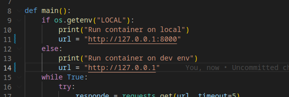

# Actividad 3 - Fundamentos de docker II


## Contenerización de una aplicación Flask y Consumer

Este ejemplo crea una API basica de flask, con un consumidor que accede desde el service de la API.

Lenguaje: Python Version: >3.8

### Arquitectura


```
src
├── app
│   ├── app.py
│   └── templates
│       └── index.html
└── consumer
    └── consumer.py
```

-  Analizar como comunicar ambos servicios 

### Tips

- Probar la applicación y el consumidor de python **SIN DOCKER** y ver cómo trabajan

1. Aplicación utilizando Ubuntu18.04. 
2. Instalar python3 , python3-pip and flash
3. Ir a src/app y ejecutar la app (servicio 1)

```
python3 app.py
```

4. Ir a src/consumer, modificar lineas 11 y 14  y ejecutar el consumer (servicio 2) 



```
LOCAL=true python3 consumer.py
```

- Si se pueden conectar, intente dockerizar la app y el consumer mediante archivos Dockerfiles.

- Cree un archivo docker-compose.yml para reemplazar la actividad anterior.


