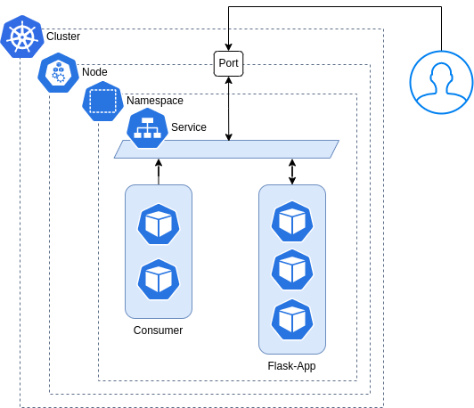

# Actividad 5 - Conceptos avanzados de Docker 


        
Intente desplegar actividad3 de la semana2

**Desafío**
- Crear el Dockerfile de la APP y Consumer
- Push de la imagen en el Registry de Docker-hub
- Apunta a las buenas practicas
- Pueden Desplegar ambas aplicaciones usando en Play with Docker, Killercoda, etc
- Crear los manifiestos de acuerdo a su analisis cual aplicaría segun el diagrama.
- Service de tipo Nodeport

Tips: La app corre sobre el port=8000 y el consumer necesita que el servicio se llame http://service-flask-app


- APP
- Consumer

```
Version de Python Soportada:
python:3.8-alpine
python:3.10.8-alpine
```
Este ejemplo crea una API basica de `flask`, con un consumidor que accede desde el service a la API. 

La Aplicacion se expone en el puerto port: 8000, ademas para que el consumidor lo pueda tomar es necesario que el contenedor se llame service-flask-app

El consumidor requiere esta variable de entorno
```
          env:
            - name: PYTHONUNBUFFERED
              value: "1"
            - LOCAL: 'true'    
```    


**Alternativas de despliegue**
- Cluster de k8s (EKS)/minikube/kind/k3s,etc
- Alternativa Killercoda


