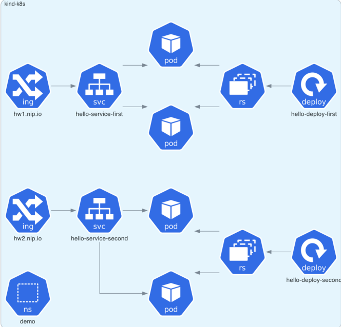

# Actividad 8 - Conceptos avanzados de Docker 

Basado en la anterior actividad,

1. Despliegue la siguiente arquitectura en `Kubernetes`

2. Incremente la cantidad de replicas de los deployments a 2 

Opcional: puede crear un namespace llamado `demo`

**Alternativas de despliegue**
- Cluster de k8s (EKS)/minikube/k3s/etc
- Alternativa Killercoda
